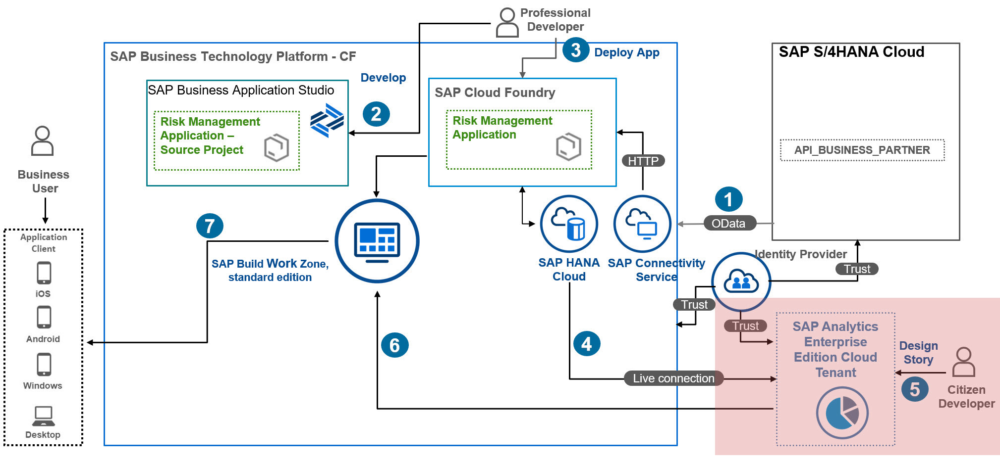

# Add a Bar Chart in SAP Analytics Cloud

In this section, you will add a bar chart graph based on the story previously created:
  1. Design a Bar Graph Chart
  2. Add Colors to the Bar Graph Chart

## 1. Design a Bar Graph Chart

In this step, the risk manager John wants to answer the following question: Which partners have developed and accumulated higher risk cost over time, and more precisely in the last 3 years? John decides to design a bar graph chart, where the vertical axis represents the total amount of risk cost and the horizontal axis show the Partners names. 

1. Choose the **Story** tab.
2. Choose insert a **Numeric Point Chart** to display the total risk amount. 
3. Choose **Designer**, and then choose **Builder**.
4. Choose **Comparison**, and then choose **Bar-Column**.
5. In the **Chart Orientation** dropdown menu, select **Vertical**.
7. In the **Measures** field, set **IMPACT**.
8. In the **Dimensions** field, set **PARTNERNAME**.

## 2. Add Colors to the Bar Graph Chart

1. After adding the charts, navigate to the **Styling** section in SAP Analytics Cloud to add custom styles and colors to the charts. 

>Result: the chart should look like this:

From this graph chart, John easily identifies that Walldorf Corp together with Leonard Corp are the principal partners responsible for generating higher risk cost.
Before implementing any mitigation measures with those partners, John decided to dive deeper into his findings, to understand how risk costs might evolve in the next quarter for those Partners.

2. Save the story 

### Result
You have added a bar chart graph to understand the risk costs developed and accumulated by Partners over time.

### Next Step
You will add Time Series chart In SAP Analytics Cloud to understand how risk costs will evolve for those partners in the next quarter.
