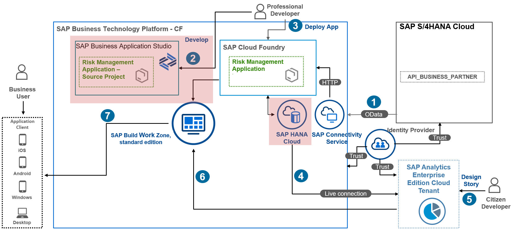

# Create Calculation Views in SAP HANA Cloud

In this section, you will learn how to create a Calculation view in SAP HANA Cloud. The Calculation view is then consumed in SAP Analytics Cloud using Live Data Connection to create a story for detailed data analysis.



## 1. Create a View

Let's create a **view-RM.hdbview** view based on the **SAP_UI_RISKMANAGEMENT_RISKS** table. Upload the **[view-RM.hdbview](./view-RM.hdbview)** under **./cloud-cap-risk-management-ext-service-s4hc-use/db/src** file or follow the steps to create a view in the SAP HANA database:

1. Open the **command palette** (Crtl + Shift + P) and choose **SAP HANA: Create SAP HANA Database Artifact** in the list of commands displayed. As a result, the **Create SAP HANA Database Artifact** wizard is displayed.
2. Choose **Browse for Folder**, select the **project’s ../cloud-cap-risk-management-ext-service-s4hc-use/db/src** folder, and choose **Open**.
3. Choose **HANA Cloud** as the database where you want to create the new artifact.
4. In the **artifact type** box, enter **hdbview**, and choose **SQL View (hdbview)** from the list that appears.
6. Name the file **view-RM**. The appropriate file suffix **(.hdbview)** is appended to the name by the wizard.
7. Save the changes and create the new database artifact.


8. Now you can see the project in the **Explorer** section of **SAP Business Application Studio**.


9. Open for editing the new **view-RM.hdbview** database view artifact, and replace the content of the file with the following SQL script :

>Hint: date format is restricted to (YYYY, H1/H2, YYYYQ, YYYYMM, YYYYWW, YYYY-MM-DD ) on the use of SAP HANA Cloud with Live Data Connections, so we should format
>fields CREATEDAT and MODIFIEDAT.  

>
```sql
VIEW "view-RM"
AS 
SELECT  
    TO_DATE(TO_NVARCHAR("CREATEDAT",'DD-MM-YYYY'), 'DD-MM-YYYY') "CREATEDAT",
    TO_DATE(TO_NVARCHAR("MODIFIEDAT",'DD-MM-YYYY'), 'DD-MM-YYYY') "MODIFIEDAT",
	"ID" ,
	"TITLE" ,
	"PRIO" ,
	"DESCR" ,
	"MITI_ID" ,
	"IMPACT" ,
	"SUPPLIER_ID" ,
	"CRITICALITY",
	"PARTNERNAME"
FROM
SAP_UI_RISKMANAGEMENT_RISKS
```
>Hint: Files are auto saved, but this might take a few seconds.

10. Right click on the **mta.yaml** file to Build MTA project.
11. Goto **SAP HANA PROJECTS** in the bottom, click on folder **src(pending deployment)**, choose **Deploy**  to deploy view-RM.hdbview.

### 2. Add a Calculation View

Upload the **[calcview-RM.hdbcalculationview](./calcview-RM.hdbcalculationview)** file in the **./cloud-cap-risk-management-ext-service-s4hc-use/db/src** folder or follow the steps to create a Calculation View in the SAP HANA database:

1. Open the **command palette** and choose **SAP HANA: Create SAP HANA Database Artifact**.
2. Choose **Browse for Folder**, select the **../projects/cloud-cap-risk-management-launchpad-service/db/src** folder, and choose **Open**.
3. Choose **HANA Cloud** as the database where you want to create the new artifact.
4. In the **Artifact Type** box, enter **hdbcalculationview**, and choose **Calculation View (hdbcalculationview)** from the list that appears.
5. Select the **CUBE** data category.
6. Name the file **calcview-RM**. The appropriate file suffix **(.hdbcalculationview)** is appended to the name by the wizard.
7. Save the changes and create the new database artifact.
8. Right click on the **mta.yaml** file to Build MTA project.


8. Goto **SAP HANA PROJECTS** in the bottom and **Open** the file **calcview-RM.hdbcalculationview** in **/src/gen** folder.


9. Choose **"(+)"** to open the **Find Data Sources** dialog box, select the **View** radio button and enter in the filter : **view-RM**.


>Hint: If you want to see all objects available via the connection service, enter ** in the search field.

10. Double click **projection_1**, then choose **Mapping**. Here you can select which columns will be part of the output. Select all columns by double clicking **view-RM** below the Data sources. You can see they are added to the output section on the right. Connect the **Join** node to the **Aggregation** node above it. Just click the **arrow icon** of the **Join** node and drag and drop it on the **Aggregation** node.


11. Choose Aggregation, then double click on Projection_1 below the Data sources

12. Choose **Semantics**, then **Columns**, and select the **CRITICALITY** checkbox.


13. Deploy the Calculation View. On the SAP HANA Project panel next to the Calculation View name or on the top right corner of the screen, choose .

14. Preview the results of your Calculation View directly in the Calculation View editor in SAP Business Application Studio. Right-click the **Aggregation** node and select **Data Preview**. This will open the data preview inside the Calculation View editor.

### 4. Preview Data in the Calculation View

Preview the results of your Calculation View directly in the Calculation View editor in **SAP Business Application Studio**.

1. Right-click the **Aggregation** node and select **Data Preview**. This will open **Data Preview** inside the Calculation View editor.


2. Choose **Analysis** or **Raw Data** to see the output of the Calculation View so far.


>Hint:  You can also access the data preview by choosing  next to the name of the project. This will open a new tab with the SAP HANA Database Explorer.

3. On the list of databases, you will now see the HDI container that represents your Calculation View. Expand the catalog of that **HDI container**, and choose **Column Views**.

4. Choose the name of your Calculation View in the panel below the catalog, and then choose **Open Data**.


### Result
You have learned how to add SAP HANA Database artifacts of type View and a Calculation View to your project. 

### Next Step
You will create a SAP HANA Live Data Connection to consume the Calculation View you just created.

