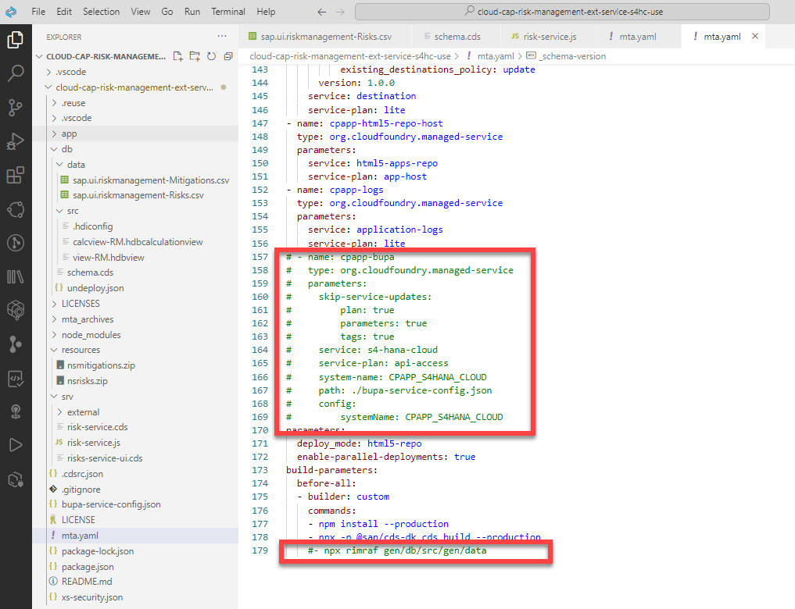

# Add Custom Logic to Risk Management Application

In this section, you will modify the Risk Management application to effectively handle analytics scenarios through the following steps:
 
 1. Incorporate a historical risk sample dataset as a foundation for generating a predictive forecast.
 2. Implement code snippet to handle a new custom field called "partnerName" to display the partner's name in analytics chart.
 3. Customize  configuration files to utilize the mock-server destination rather than the S/4HANA Public Cloud. 
 

### 1. Incorporate a Historical Risks Sample Dataset 
You can use the already prepared 3 years of historical data with a month granularity. We recommend that you use a 5:1 ratio, or 5 months of historical data for each month of forecast. This ratio ensures that the engine can detect enough cycles to create a forecast.  

Replace the content of the file located in the **../db/data/sap.ui.riskmanagement-Risks.csv** folder with the content in the **[sap.ui.riskmanagement-Risks.csv](./sap.ui.riskmanagement-Risks.csv)** file.

 

### 2. Add a Custom partnerName Field

In this step, the risks table will be enhanced with a new field called **partnerName** in order to visualize the Partners in the analytics dashboard.

1. Replace the content of the file located in the **../db/schema.cds** folder with the content in the **[schema.cds](./schema.cds)** file. We have added a new field called **partnerName** in the **Risks** entity and also a search combo item:

 

2. Replace the content of the file located in the **../srv/risk-service.js** folder with the content in the **[risk-service.js](./risk-service.js)** file. We have added a code snippet to manage the Risk UI Partner, and a combo box to save the value of the **partnerName** field in the database.

 

### 3. Customize Configuaration Files

1. Replace the content of the file located in the **../package.json** with **[package.json](./package.json)** folder to manage the new **cpapp-bupa** destination related to the **[mock-server](https://github.tools.sap/D055164/btp-sac-forecast/tree/main/documentation/set-up/install-mock-server):**

 

2. Replace the content of the file located in the **../mta.yaml** with **[mta.yaml](./mta.yaml)** file, where we have disabled the connectivity to the SAP S/4HANA Cloud Extensibility service with technical name **s4-hana-cloud** and service plan **api-access**  in order to use the [mock-server](https://github.tools.sap/D055164/btp-sac-forecast/tree/main/documentation/set-up/install-mock-server).

 
 
>Hint: The command **npx rimraf gen/db/src/gen/data** will remove the sample dataset CSV files required to fill the risks table in the SAP HANA database after the initial application deployment. See [Providing Initial Data](https://developers.sap.com/tutorials/btp-app-cap-mta-deployment.html).

### Result
You have customized the Risk Management reference application.

### Next Step
You will deploy the Risk Management application to the Cloud Foundry environment.
