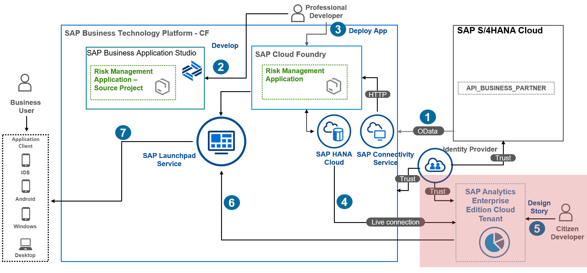
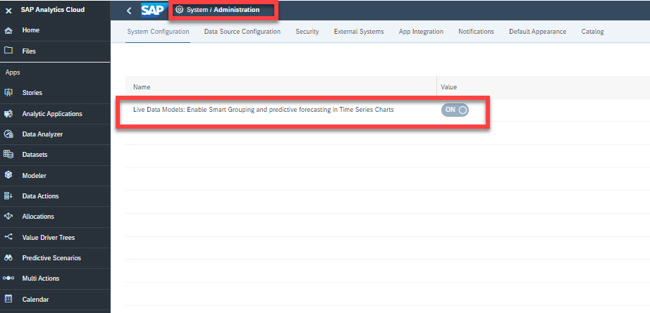
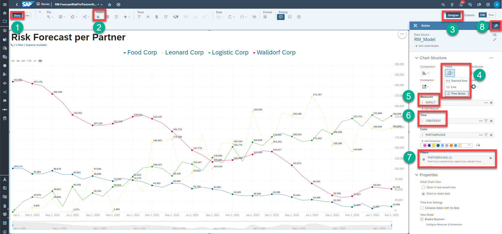
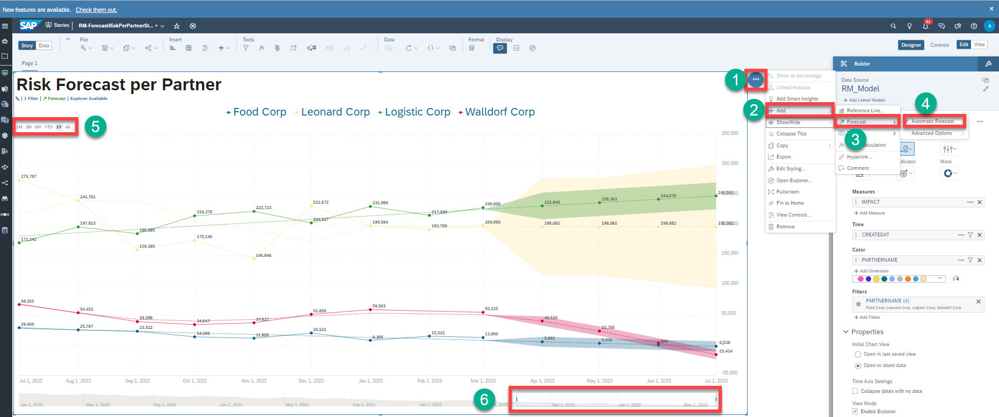
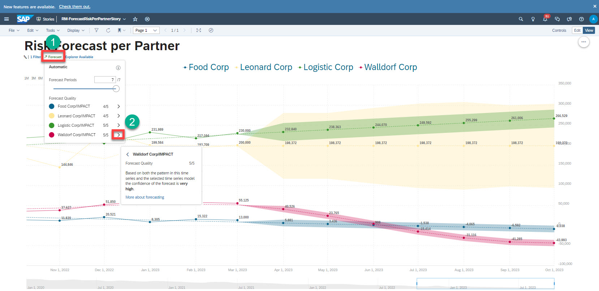

# Add Time Series Chart in SAP Analytics Cloud

In this section, you will add a visualization chart where a series of data is plotted against a time axis. 
This type of chart is called a Time Series chart, which displays values changing over time :

 1. Prerequisites
 2. Add Time Series chart
 3. Add forecast chart
 4. Determine the quality of the forecast
 

## 1. Prerequisites

To use forecasting for Time Series Charts and Line Charts on live data connections for a tenant, you should enable the system configuration setting **Live Data Models: Enable Smart Grouping and predictive forecasting**.
 
1. In **SAP Analytics Cloud**, choose **System** &rarr; **Adminstrator**.
2. Search for **Enable Smart Grouping and predictive forecasting**.
 

## 2. Add Time Series Chart

To make confident decisions, John, the risk manager, added a Time Series chart that allows him to predict future values based on historic values, in this case risk amount by month granularity.

1. Choose the **Story** tab.
2. Add a **Numeric Point Chart** to display the total risk amount. 
3. Choose **Designer**, and then choose **Builder**.
4. Choose **Trend**, and then choose **Time Series**.
5. In the **Measures** field, set **IMPACT**.
6. In the **Time** field, set **CREATEDAT**. Time should always be of data type Date.
7. In the **Filters** field set **PARTNERNAME**. Select all 4 Partners.
8. To color the line graph, add a color from the palette.

## 3. Add Forecast Chart

To add a forecast to the chart, you need to select the forecasting option on the chart:

1. Choose **...**, and then choose **(+Add)**. 
2. Choose **Forecast**, and then choose **Automatic Forecast**.
3. Above the chart, there are options to filter and visualize the Time Series chart accordingly: **1/3/6 M(Month), YTD(year to date), 1 Year, All (all months available)**.
4. Below the chart, you can use the **Slider** to select specific time range. 

>Hint: Automatic forecast is a process that evaluates several algorithms and models and uses a combined model that analyzes trends, fluctuations and seasonality. The forecasting function uses SAP’s proprietary time series technology to analyze historical time series data.

## 4. Determine the Quality of the Forecast

To confidently base a decision on a forecast,  you need to understand the forecast quality. The quality of the forecast is provided in two ways:
* In terms of a simple **0 to 5 rating** where 5 is a very good forecast. The quality can be seen by choosing the forecast link at the top of chart. The figure below shows the details of the forecast, and the 5/5 rating. A natural language explanation of the quality can also be seen by selecting the ">" to the right of the rating and as you can see this quality is rated as very high.
* In terms of **Confidence Interval** which corresponds to the upper and lower limit with respect to the forecasted value (shown as a shaded area), a narrow confidence indicates a smaller possible range of values around the predicted value and hence a more confident forecast.

Therefore in the next quarter, the risk trend will most likely continue to decline steadily for the Partner Walldorf Corp to nearly 0, even though this partner has accumulated higher risk cost over time with very high confidence of the forecast.

Once identifying the Partners who have accumulated higher risk costs over time, John might take the following actions:
* Communicate with the identified Partners involved in food delivery like Logistic Corp the accumulated risk costs.
* Replace the working relationship with the Partner that is causing a high cost risk with an alternative Partner.
  
## Result
You have finished a Time Series chart with forecast feature that helps to predict future values based on the historical values.

## Next Step
You will integrate analytical stories we have built in SAP Build Work Zone, standard edition.
