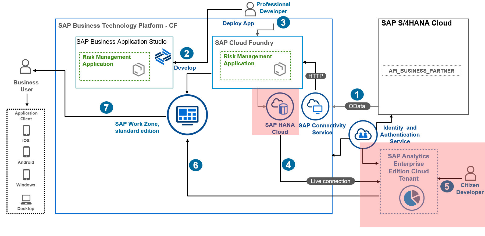
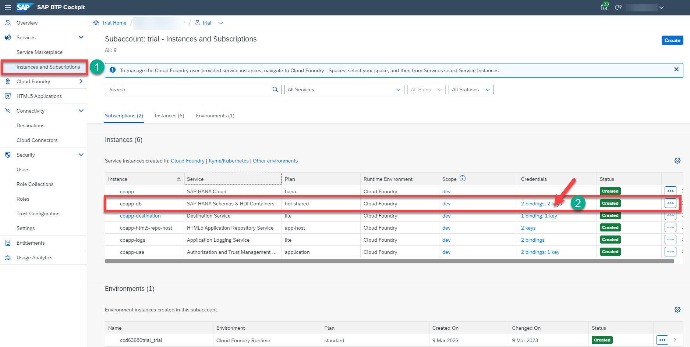
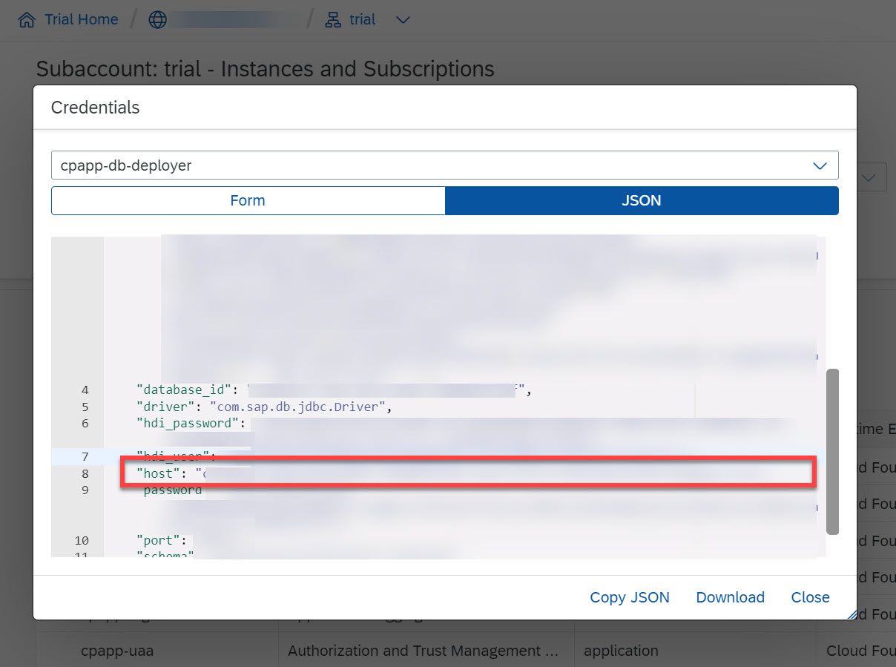
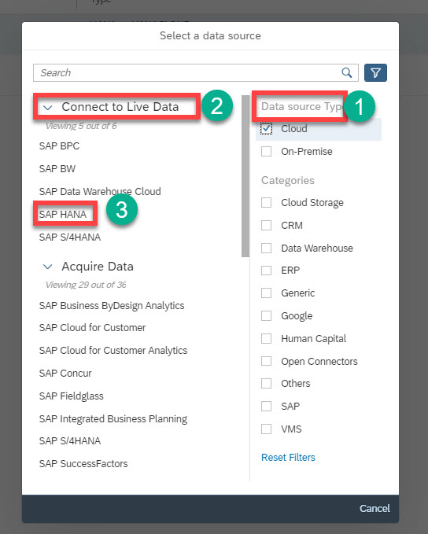
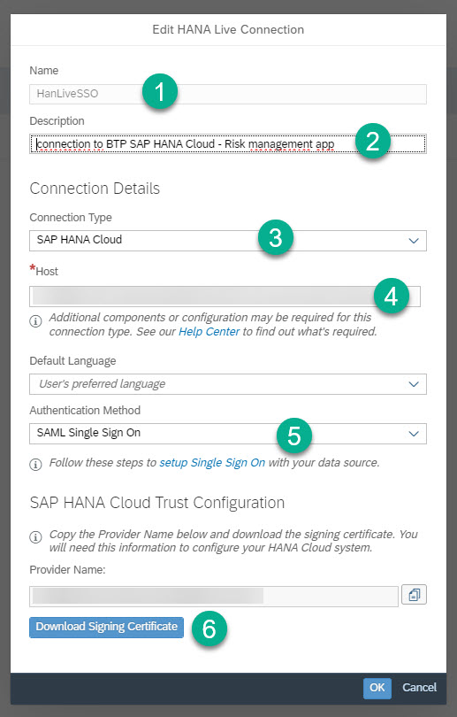
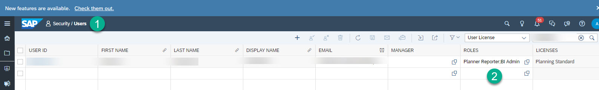

# Consume calculation view in SAP Analytics Cloud

In this section, you will learn about the creation of a Live Data Connection from SAP Analytics Cloud (SAC) to SAP HANA Cloud with Single-Sign-On. The Live data Connection in SAC enables you to consume the calculation view created on top of SAP HANA Cloud as a data source to create visualizations.

## 1. Prerequisites
* This connection type works only in Cloud Foundry environments (non-SAP data centers). For Neo environments (SAP data centers), see Live Data Connection to SAP HANA Cloud Using a Direct Connection and SSO.
* Users need to have read access to SAP HANA Cloud database Calculation views that will be used to create and view models and stories in SAP Analytics Cloud. Learn how to grant access to an HDI Container’s Schema.
* SAC can only see Calculation views of type CUBE (which include aggregation).
You cannot use Calculation views of type dimension, nor tables, nor SQL views for analysis in SAC. See this help page to learn more about HDI containers and the way users are set up.
* You must use OAuth 2.0 for authentication.
* SAML SSO must be enabled in SAP Analytics Cloud. For more information, see Enabling a Custom SAML Identity Provider.
* The following steps must be carried out by a user who has administrator-level privileges in SAP HANA Cloud and SAP Analytics Cloud, and logs on to SAP Analytics Cloud via the SAML Identity Provider. For the steps in the SAP Analytics Cloud system, the BI Admin role is required. For the steps in the SAP HANA Cloud system, the Administrator role is required.

## 2. Create connection between SAP HANA Cloud and SAP Analytics Cloud

* Navigate to SAP BTP account and select the dev space and then choose Instances and Subscription menu. Here you will get to see the application instances then select cpapp-db

* Click on the keys, to see the credentials to be used for establishing live connection in SAP and  copy the field “host”:

* Go to SAP Analytics Cloud tenant, click on connections then click on the + icon to create a live data connection setting. select Cloud in Data source Type, then  Select Connect to Live Data then choose SAP HANA.

* To access SAP HANA Cloud data without having to set up the SAP HANA Analytics Adapter, you can create a live data connection using the “SAP HANA Cloud” connection type :
   * Provide a name to HANA Live connection. Select the connection type as SAP HANA Cloud.
      hostname would be the HANA Cloud endpoint without the port.
   * (Optional) Choose a Default Language from the list
   * Under Authentication Method select SAML Single Sign On.
   * For SAML Single Sign On only, copy the SAML Identity Provider (IdP) from the Provider Name field in the connection dialog, and also download the certificate from this dialog
   * You’ll need these two items to perform SAP HANA Cloud trust configuration to set up SAML SSO.
  

* Continue with the next step now, DON’T select Button OK to finish creating this connection.

* Goto Security –>Users and Add to SAC User any of these standard application roles: Admin, Application Creator, BI Content Creator, BI Admin, and Planner Reporter.

