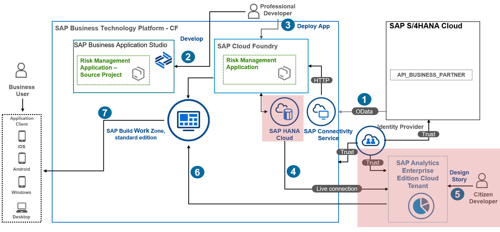

# Create a Live Data Connection in SAP Analytics Cloud

In this section, you will learn about the creation of a Live Data Connection from SAP Analytics Cloud to SAP HANA Cloud with Single Sign-On (SSO). The Live Data Connection in SAP Analytics Cloud enables you to consume the Calculation Views created on top of SAP HANA Cloud as a data source to create visualizations: 
  
  1. Prerequisites
  2. Create Connection Between SAP HANA Cloud and SAP Analytics Cloud
 

## 1. Prerequisites
1. This connection type works only in Cloud Foundry environment (non-SAP data centers). For Neo environment (SAP data centers), see [Live Data Connection to SAP HANA Cloud Using an "SAP HANA Cloud" Connection](https://help.sap.com/docs/SAP_ANALYTICS_CLOUD/00f68c2e08b941f081002fd3691d86a7/b152affae88841cb9fec310fb8b7b94b.html).
2. SAP Analytics Cloud can only see Calculation views of type CUBE (which include Aggregation).
You cannot use Calculation views of type Dimension, nor tables, nor SQL views for analysis in SAP Analytics Cloud.
3. SSO must be enabled in SAP Analytics Cloud. For more information, see [Enabling a Custom SAML Identity Provider](https://help.sap.com/docs/SAP_ANALYTICS_CLOUD/00f68c2e08b941f081002fd3691d86a7/3651184dad944aa2b361ad029a7a8cae.html?q=Enabling%20a%20Custom%20SAML%20Identity%20Provider)
4. The following steps must be carried out by a user who has administrator-level privileges SAP Analytics Cloud, and logs on to SAP Analytics Cloud via the SAML identity provider. For the steps in the SAP Analytics Cloud system, the BI Admin role is required. 

## 2. Create Connection Between SAP HANA Cloud and SAP Analytics Cloud

1. Open  the **SAP BTP cockpit**, navigate to your subaccount and choose **Services** &rarr; **Instances and Subscriptions**. From the **Instances** list, select **cpapp-db**.
2. Click on **keys**, to see the credentials that are going to be used for establishing live connection. 

3. Copy the value of the **"host"** parameter from **Credentials** windows:

4. In the SAP Analytics Cloud tenant, choose **Security** &rarr; **Users** and add to the SAP Analytics Cloud user any of these standard application roles: **Admin, Application Creator, BI Content Creator, BI Admin, and Planner Reporter**.
    
5. Open to the **SAP Analytics Cloud** tenant, choose **Connections**, then choose **"+"** to create a live data connection setting. Select the **Cloud** checkbox in **Data source Type**, expand **Connect to Live Data**, and then choose **SAP HANA**.

>Hint: To access SAP HANA Cloud data without having to set up the SAP HANA Analytics Adapter, you can create a live data connection using the **SAP HANA Cloud** connection type.

6. Provide a name for the **HANA Live Connection**. Select the **SAP HANA Cloud** connection type.
**hostname** would be the SAP HANA Cloud endpoint without the port number.
7. (Optional) In the **Default Language** dropdown menu, select a language.
8. In the **Authentication Method** dropdown menu, select **SAML Single Sign On**.
9. For SAML Single Sign-On only, copy the **SAML Identity Provider** from the **Provider Name** field in the connection dialog, and also choose **Download Signing Certificate** from this dialog.
>Note: You’ll need these two items to perform SAP HANA Cloud trust configuration to set up the SAML Single Sign-On.
  

10. Continue with the next step, and **DON’T** choose **OK** to finish creating this connection.

### Result
You have finished the set up of a live data connection from SAP Analytics Cloud.

### Next Step
You will set up the trust between SAP HANA Cloud and SAP Analytics Cloud.

