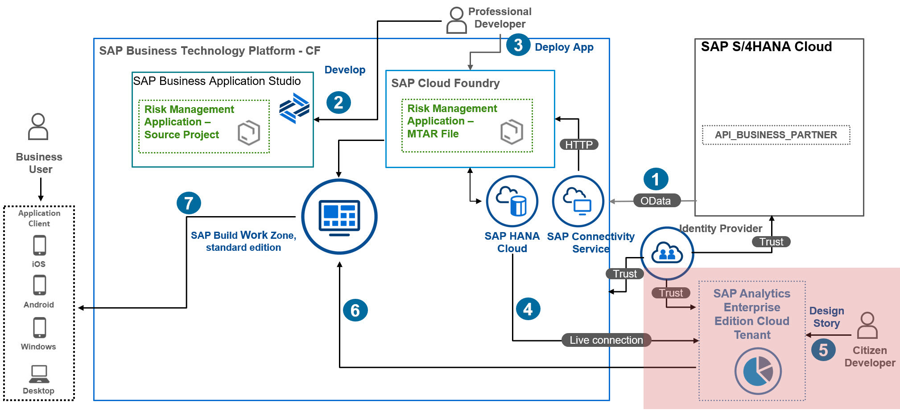

# 1. Create Live Data Model in SAP Analytics Cloud

In this section, you will learn how to create a Live Data Model in SAP Analytics Cloud. The created Live Data Model is later consumed in a story as a data source for detailed data analysis.

1. To create a Live Data Model, navigate to the **Modeler** section in SAP Analytics Cloud. Choose **Modeler**.
2. In the **Models** tab, choose **Live Data Model**.

3. In the **System Type** field, select **SAP HANA**.
4. In the **Connection** field, select the connection that you have previously created.
5. In the **Data Source** field, enter the first three letters of the Calculation view. The Calculation view that you have previously created in SAP Business Application Studio is listed and you can select it.

6. All measurements and attributes that are part of the model appear.
7. Specify a name for the model and then choose **Save**.

# Result
You have created a Live Data Model.

# Next Step
You will set up a story using the Live Data Model you have just created in SAP Analytics Cloud.
