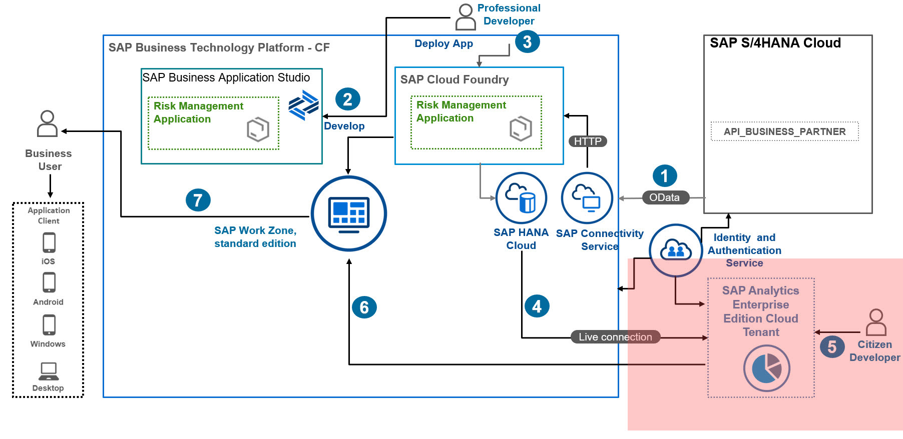
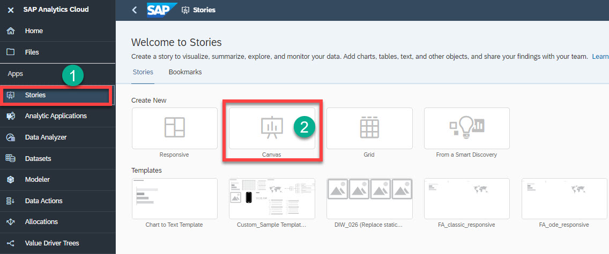
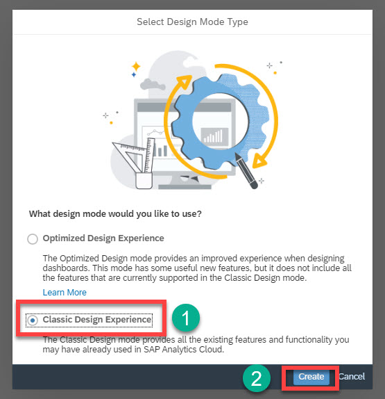
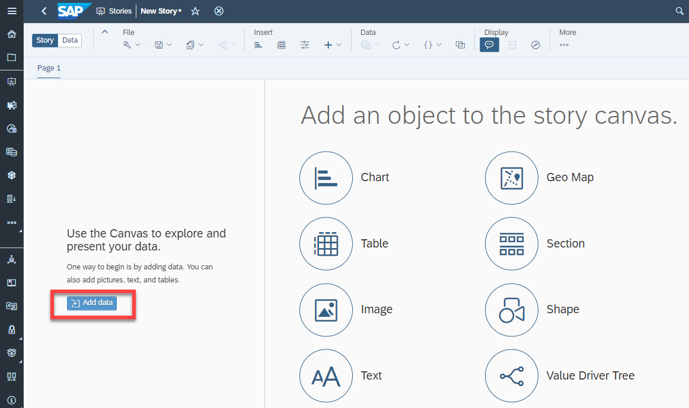
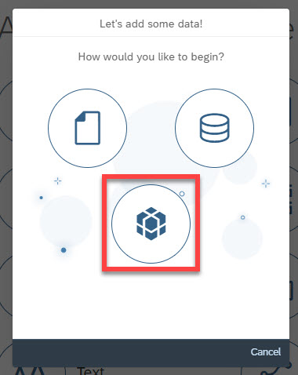
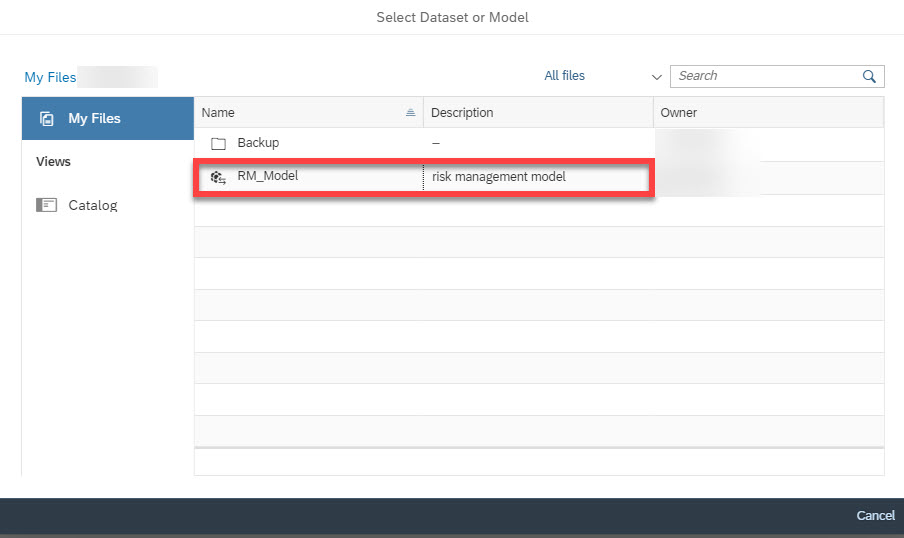
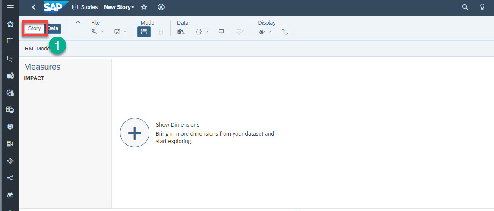

# Create Story in SAP Analytics Cloud

In this section, you will set up a new story based on Live Data Model data source created in the previous step.

1. From the **Home** screen of SAP Analytics Cloud, in the **Create New** section, choose **Stories**, and then choose **Canvas**.

2. In the **Select Design Mode Type** dialog, select the **Classic Design Experience** radio button, and choose **Create**.

3. A new story appears. Choose **Add data**.

4. Choose **Data From an Existing Model**. This will navigate you to the list of models that are available.

5. Select the model that you have created in the previous steps.

>Result: This will bring you to **New Story** canvas where you can start building charts and analyze the data from the model.

# Result
You have set up a new story based on Live Data Model data source.

# Next Step
You will construct a bar chart graph based on this story.
