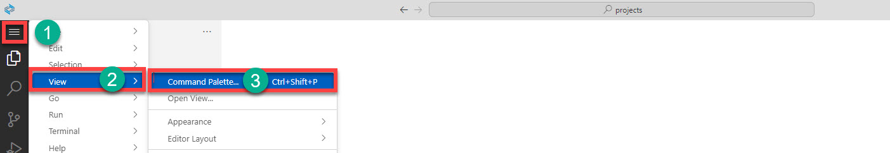
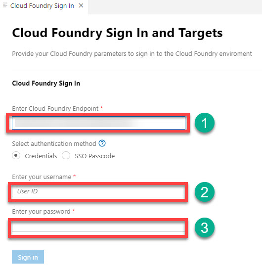
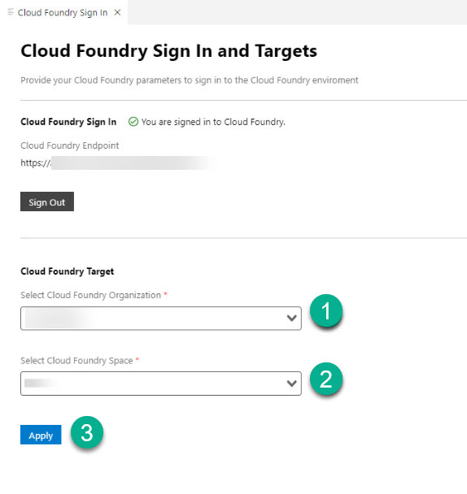
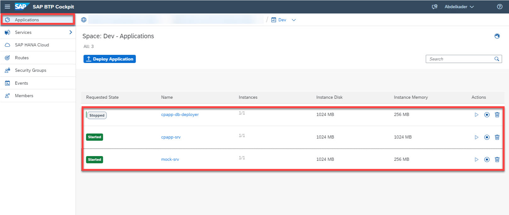
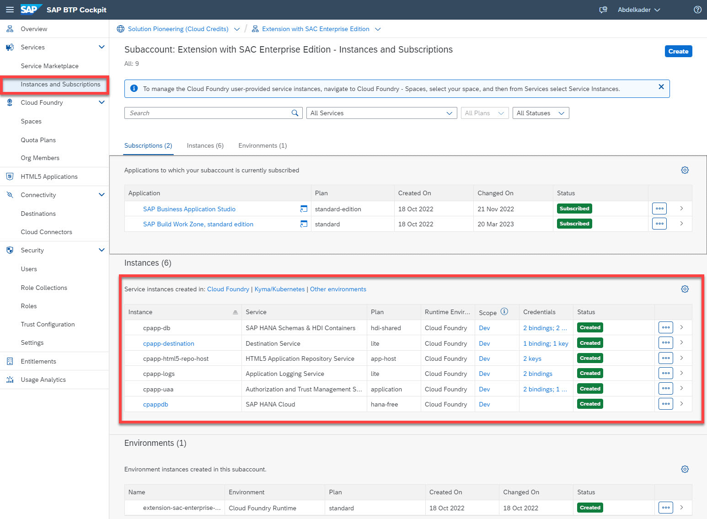
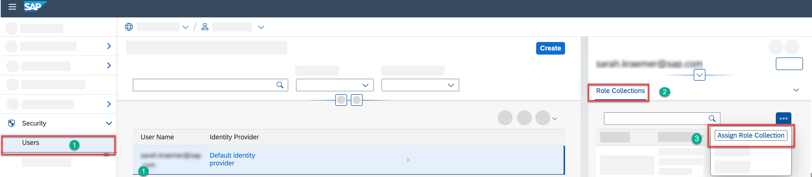
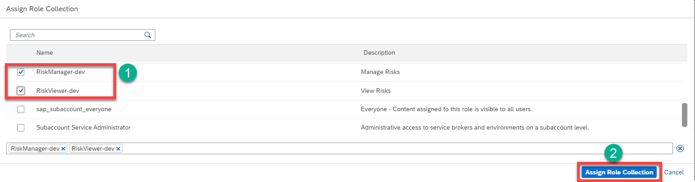

# Deploy Application to Cloud Foundry Environment

In this section, you will : 

 1. Deploy the Risk Management Application to the Cloud Foundry Environment
 2. Assign Role Collections to the end users.

### 1. Deploy the Risk Management Application to the Cloud Foundry Environment

1. In **SAP Business Application Studio**, open the **command palette** and choose **View** &rarr; **Command Palette** or press **Crtl + Shift + P** and enter the command **cf login**.

2. Fill in the **Cloud Foundry API Endpoint** field, then enter your username and password.

3. Choose **Cloud Foundry Target**, select **Organization** and **Space**, and  then choose **Apply**.

4. Build the MTA module from the root folder of your project.
5. Deploy the module to your current Cloud Foundry space via context menu of the build archive. The deployment might take some minutes.
6. Check if all applications and services have been created.

### 2. Assign Role Collection

As a developper, before you can use the application, the following roles need to be assigned to developers and business users, so they are able to edit and view the data from the application.

1. Go back to the SAP BTP cockpit.
2. Navigate to **Security** &rarr; **Users**.
3. Choose your username, and then choose **Assign Role Collections**.

5. In the pop-up, find **RiskManager-dev** and **RiskViewer-dev** and select the respective checkboxes to assign the roles.
6. Choose **Assign Role Collection**.

### Result
You have deployed the Risk Management reference application to the Cloud Foundry environment and assigned the application role collection.
### Next Step
You will integrate the Risk Management application with SAP Build Work Zone, standard edition.
