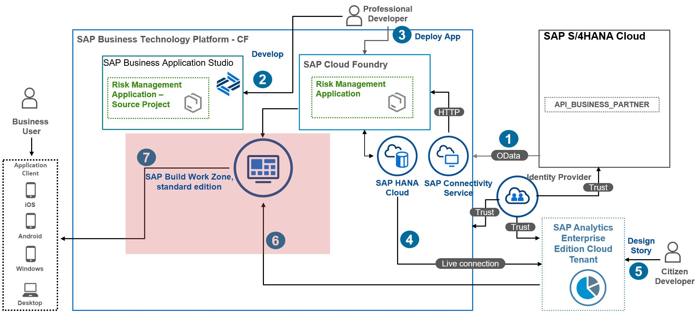
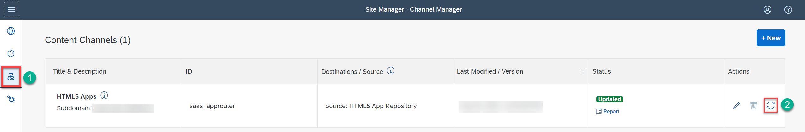
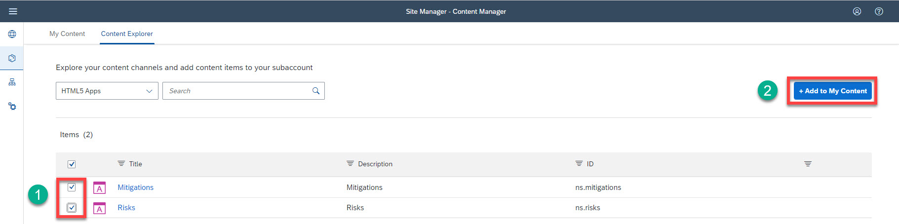

# Integrate the Risk Management Application with SAP Build Work Zone, standard edition

In this section, you will connect the Risk Management application to SAP Build Work Zone, standard edition. This allows to have one central entry point to show all your SAP BTP applications :

 1. Create Your SAP Build Work Zone, standard edition Site
 2. Launch Your SAP Build Work Zone, Standard Edition Site
 

## Create Your SAP Build Work Zone, standard edition Site

1. Open the **SAP BTP cockpit**, navigate to your subaccount and choose **Servces** &rarr; **Instances and Subscriptions**. 
2. From the **Subscriptions** list, select **SAP Build Work Zone, standard edition**.

3. Choose **Channel Manager** on the left-hand side and refresh the HTML5 Apps entry, because the content providers aren’t reloaded automatically when you push an application, so it’s important to manually refresh.

4. Choose **Content Manager** &rarr; **Content Explorer** and open the content provider **HTML5 Apps**.

5. Select the **Risks** and **Mitigations** checkboxes, and then choose **Add to My Content**.

6. Choose **Content Manager** &rarr; **My Content**.

7. In the **Items** list, choose **Everyone**. **Everyone** is a role that has to be assigned to the Risks and Mitigations applications so all users can access them.

8. Choose **Edit**, then choose **+ Search for items to assign** field. Choose **"(+)"** to assign the Risks and Mitigations applications to the role, and choose **Save**.

9. Navigate back to **My Content**.
10. Choose **New** &rarr; **Group**.

11. In the **PROPERTIES** tab, in the **Title** field, enter **Risk Management**.Then, assign the **Risks** and **Mitigations** alications to it, to display the Risks and Mitigations applications in a group called Risk Management.

12. Choose **Site Directory** &rarr; **Create Site**, and in the **Site Name** field, enter **Risk Management**. Choose **Create**.

The new site gets the Everyone role by default, so you don’t have to assign it explicitly.

## 2. Launch Your SAP Build Work Zone, Standard Edition Site

1. Choose **Go to Site**.

2. You can see the Risk Management group that includes the Mitigations and Risks applications.

3. Go to the application and choose the **Risks** tile. Then, choose **Go**.

4. Now, you should be able to create new entries entries in the Risks application.

### Result
You have integrated the Risk Management reference application in SAP Build Work Zone, standard edition.

### Next Step
You will add Calculation Views to the Risk Management application to be consumed in SAP Analytics Cloud later on.
