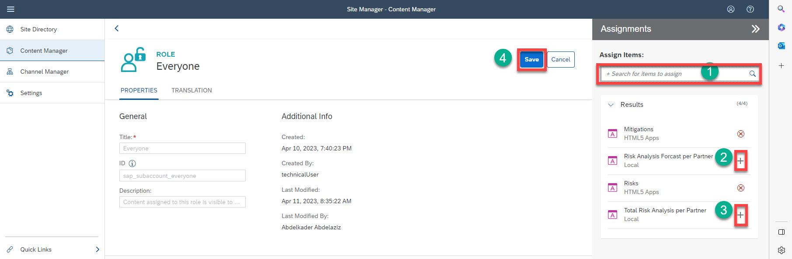

# Integrate Analytical Stories in SAP Build Work Zone, standard edition

In this section, you will integrate the story URL in SAP Build Work Zone, standard edition :

 1. Copy the URL of the Bar and Time Series charts
 2. Create new app for the Story 
 3. Assign apps to groups 
 4. Assign apps to roles
 

## 1. Copy the URL of the Bar and Time Series Charts

1. In SAP Analytics Cloud, go to **File**, and choose **Share**. 
2. Copy the default link of the Bar chart and the Time Series chart we have built in the previous steps. You will use this link in SAP Build Work Zone to call the story URL.

## 2. Create New App for the Story 

1. In SAP BTP cockpit, choose **Services** &rarr; **Instances and Subscriptions**. 
2. From the **Subscriptions** list, select **SAP Build Work Zone** and choose **Go to Application**.
3. Choose **Content Manager**, then choose **Create** &rarr; **App**.

4. The app editor opens with the **PROPERTIES** tab in focus. Enter the following values:
  * In the **Title** field, enter **Total Risk Analysis per Partner**.
  * In the **Open App** section, select the **In a new tab** radio button.
  * In the **URL** field, paste the URL of the **Total Risk per Partner** story you have copied from the SAP Analytics Cloud story in the previous step.

5. Go to the **NAVIGATION** tab.
6. In the **Semantic Object** field, enter **risk**.
7. In the **Action** field, enter **display**.
8. Choose **Save**.

9. Repeat the same steps for the **Risk Forecast per Partner** story.

## 3. Assign Apps to Groups 

1. Choose **Content Manger** &rarr; **My Content**, and then choose the **Risk Management** group.
2. Choose **Edit**, and in the search field, choose **+** to assign the **Total Risk Analysis per Partner** and **Risk Analysis Forcast per Partner** apps to the group.
3. Choose **Save**.

## 4. Assign Apps to Roles

1. Choose **Content Manger** &rarr; **My Content**, and then choose the **Everyone** role.
2. Choose **Edit**, and in the search field, choose **+** to assign the **Total Risk Analysis per Partner** and **Risk Analysis Forcast per Partner** apps to the group.
3. Choose **Save**.

3. You will get two new tiles to access your analytics charts:

## Result
You now have integrated the story URL in SAP Build Work Zone, standard edition.
