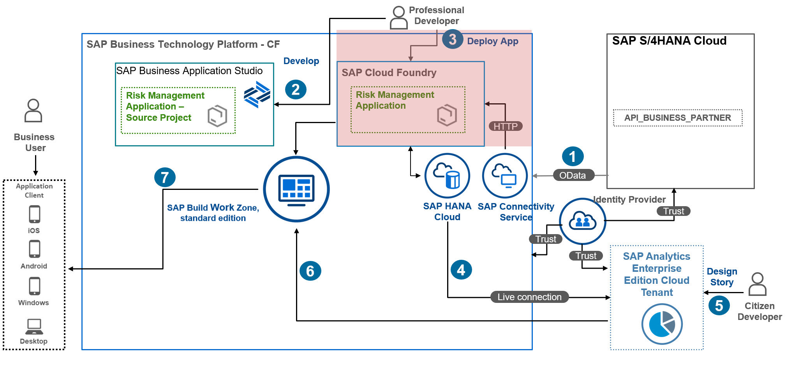
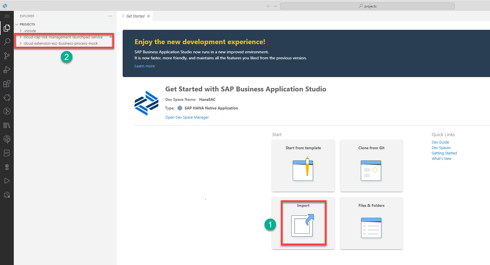

# Import Risk Management Application in SAP Business Application Studio

In this section, you will open SAP Business Application Studio, create new development spaces, and import the Risk Management reference application so you customize it adding analytics artifacts:

  

### 1. Prerequisites 

You have already set up **SAP Business Application Studio** and created a dev space, for example **HanaSAC**.

### 2.  Open the Dev Space and Import the Risk Management Application

1. Make sure there is an open workspace in your Dev Space. If there is no open workspace, follow these steps:
   1. Choose **Explorer**, and then choose **Open Folder**.
   2. Choose **projects** from the list provided in the command palette and then choose **OK**.
   

2. Import the files you have already downloaded. See [Risk Management Application GitHub repository](https://github.com/SAP-samples/cloud-cap-risk-management/tree/ext-service-s4hc-use).

### Result
You have imported the Risk Management reference applications in SAP Business Application Studio.

### Next Step
You will customize the Risk Management application to add analytics artifacts.
