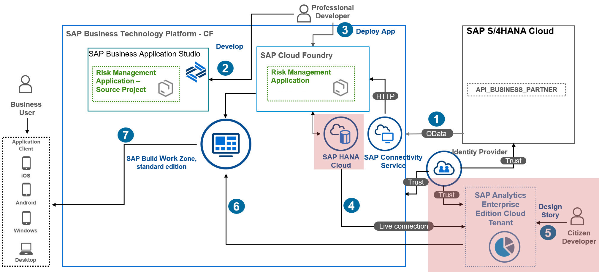

# Set up Trust Between SAP HANA Cloud and SAP Analytics Cloud

In this section, you will learn how to set up up the trust between SAP HANA Cloud and SAP Analytics Cloud with Single Sign-On to provide a seamless user experience during login process:

  1. Prerequisites
  2. Upload the certificate
  3. Create a SAML Identity Provider
  4. Create a Certificate Collections
  5. Map SAP Analytics Cloud User to SAP HANA Cloud User
  6. Grant the User Access to SAP HANA Cloud Data
  

## 1. Prerequisites

For the steps in the SAP HANA Cloud system, the Administrator role is required or [default DBADMIN user](https://help.sap.com/docs/HANA_CLOUD_DATABASE/f9c5015e72e04fffa14d7d4f7267d897/5b35402c47b344d882ac13c661aff1c0.html?version=2021_01_QRC).

## 2. Upload the certificate

1. Open  the **SAP BTP cockpit**, navigate to your subaccount, choose **SAP HANA Cloud**, and open the **SAP HANA Cloud cockpit**.
3. Log in with your DBADMIN user.

3. In the **SAP HANA Cloud cockpit**, go to **Security and User Management**.

4. Go to **Certificate Store**, and choose **Import**.
5. Choose **Import from file** to upload the certificate you have previously downloaded, or copy and paste the content of the downloaded certificate file.
6. Choose **OK**.

>Result: You will see your certificate added.

## 3. Create a SAML Identity Provider

1. Go to **SAML Identity Providers**, and choose **Add Identity Provider**.
2. In the **Identity Provider Name** field, enter a name.
3. In the **Entity ID** field, enter the SAML provider name you have copied from the connection dialog, and select the newly added certificate.
4. Choose **Add**.

## 4. Create a Certificate Collections

1. Go to the **Certificate Collections**, and choose **Add Collection**.
2. In the **Name** field, enter a name for the collection, and choose **OK**.

3. Choose **Add Certificate**.
4. Select the new certificate, and choose **OK**.
5. Choose **Edit Purpose**.
6. In the **Purpose** field, select **SAML**.
7. In the **Providers** field, select the newly created SAML identity provider.
8. Choose **Save**.

>Result: You will see your certificate collection registered.

## 5. Map SAP Analytics Cloud User to SAP HANA Cloud User

1. Open the **SAP HANA Cloud cockpit**. You need to create a user, or you can modify an existing one, and provide the proper role.
2. Go to **User Management**.
3. Choose the **General Information** tab, and fill in the username.
4. Set **Disable ODBC/JDBC Access** to **No**.

5. On the **Authentication** tab, select **SAML**.
6. Choose **Add SAML Identity**, and select your identity provider.
7. Set **Automatic Mapping by Provider** to **OFF**.
8. In **External Identity**, enter the email ID of the user who logs into the SAP Analytics Cloud tenant. This user needs to be mapped with the SAP HANA Cloud database user.
9. In your **SAP Analytics Cloud** tenant, go to **System** &rarr; **Administration** and choose the **Security** tab.
10. In the **Authentication Method** section, map the email ID of the user who logs into the SAP Analytics Cloud tenant with the SAP HANA Cloud database user. see [SAP Help Portal: (SSO only) Map an SAP Analytics Cloud user to an SAP HANA Cloud user](https://help.sap.com/docs/SAP_ANALYTICS_CLOUD/00f68c2e08b941f081002fd3691d86a7/5bd569b3f75f49f29e9ec251fd6a1386.html#(sso-only)-map-an-sap-analytics-cloud-user-to-an-sap-hana-cloud-user)
13. Copy the value of the **EMAIL** field from **Security** &rarr; **Users** tab in SAP Analytics Cloud into **External identity**.

## 6. Grant the User Access to SAP HANA Cloud Data

1. Grant your user the required access to the data that you want to expose from your SAP HANA Cloud database. In this case, grant the access role to an HDI container where we have created a Calculation view of type CUBE. 
2. Go to **Role Assignment** and choose **Add**.
3. Choose the **access_role and external_privileges_role** for the HDI container.
4. Go back to **SAP Analytics Cloud**, and finish creating the connection by choosing **OK** in the **Connection** dialog.

## Result
You have finished the setting up trust between SAP HANA Cloud and SAP Analytics Cloud with Single Sign-On.

## Next Step
You will create a Live Data Model in SAP Analytics Cloud.
