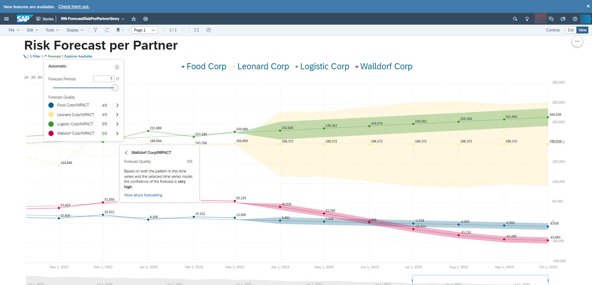
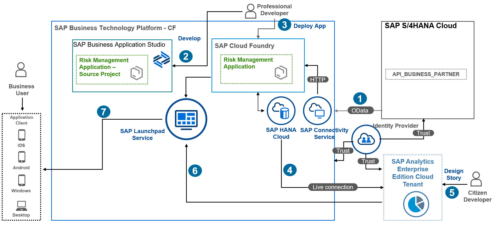

# Learn About the Goal and Outcome of the Mission

This mission shows you how to enhance a BTP application by adding analytical features such as reports, interactive dashboards and visualizations using SAP Analytics Cloud.

Once you've completed the tutorial, you'll be able to:
*	Customize an extension application on BTP using calculation views within SAP Business Application Studio.
*	Set up a Live Data Connection from SAP Analytics Cloud to SAP HANA Cloud with SSO (Single Sign On) in a few steps to access application data in real time.
*	Use SAP Analytics Cloud as One Stop tool to build dashboards and stories, analyze and forecast business data.
*	Get access to your application and analytics from one central entry point with SAP Build Work Zone, standard edition..

## Business Scenario

* Business analysts without deep statistical knowledge are guided through the steps to perform a risk analysis forecast for a food delivery service that has several vendors delivering food to the company's customers.
* The Risk Manager John, calculates the costs of service delivery issues such as late deliveries, or goods delivered in unacceptable conditions to customers
using a risk management application built on SAP BTP.

## Solution Architecture

 

Let's go over the steps required to build this scenario:

1 - With help of system admin, You connect to the backend SAP S/4HANA Cloud to fetch business partner data. If you have no SAP S/4HANA Cloud you can use mock-server CAP application.

2 - Professional developer installs and customizes the risk management application using SAP Business Application Studio and adds analytics artifact modules like calculation views.

3 - Professional developer will deploy the app to Cloud Foundry runtime.

4 - With the help of SAP Analytics Cloud tenant admin, we will set up an SSO live connection to SAP HANA Cloud persistence.

5 - Citizen developers designs interactive analytics dashboards and reports for himself or others, he can also explore data from SAP Hana cloud in real time with Live Data Connection.

6 - Citizen developers seamlessly integrate Analytical content dashboard in SAP Build Work Zone, standard edition by calling SAC Story URL.

7 - A business user, in our case, a risk manager, can access the SAP Build Work Zone, standard edition service and open the risk management application along with analytics dashboard.
