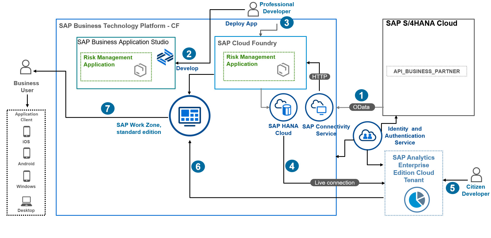

# Learn About the Goal and Outcome of the Mission

This mission is primarily intended to demonstrate how to integrate BTP extension application with analytics capabilities like reports, interactive dashboards, and visuals.
By the end of this scenario, you'll be able to:
*	Customize an extension application on BTP using calculation views within SAP Business Application Studio.
*	Set up a Live Data Connection from SAP Analytics Cloud to SAP HANA Cloud with SSO (Single Sign On) in a few steps to access application data in real time without having to set up the SAP HANA Analytics Adapter.
*	Use SAP Analytics Cloud as One Stop tool to build dashboards and stories, analyze and forecast business data.
*	Use one central point to access your application and analytics from SAP Build Work Zone, standard edition with rendering on different devices.

## Business Scenario

* This mission aims to guide Business Analysts without deep statistical knowledge through the steps to perform a risk analysis forecast for a food delivery service with several vendors, delivering food to the company's customers.

* When service delivery issues arise, such as late deliveries, or goods delivered in unacceptable conditions to customers, risk manager John calculates the risk cost for each vendor, using a risk management application built on SAP BTP.

## Solution Architecture

 
 
Let's go over the steps required to build this scenario:

1 - With system admin, we connect to the backend S/4HANA Cloud to fetch business partner data, or use a mock-server application built on CAP.

2 - Professional developer installs and customizes the risk management application using SAP Business Application Studio, by adding analytics artifact modules like calculation views.

3 - Professional developer will deploy the app to Cloud Foundry runtime.

4 - With the help of SAP Analytics Cloud system owner, we will set up an SSO live connection to SAP HANA Cloud persistence.

5 - Citizen developers designs interactive analytics dashboards and reports for himself or others, he can also explore data from SAP Hana cloud in real time with dynamic visualizations changing on-the-fly

6 - Citizen developers seamlessly integrate Analytical content dashboard in SAP Fiori launchpad by calling SAC Story URL.

7 - A business user, in our case, a risk manager, can access the SAP Build Work Zone, standard edition service and open the risk management application along with analytics dashboard.
