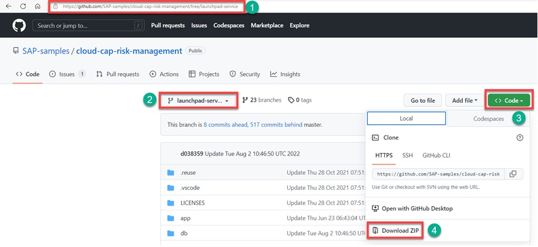
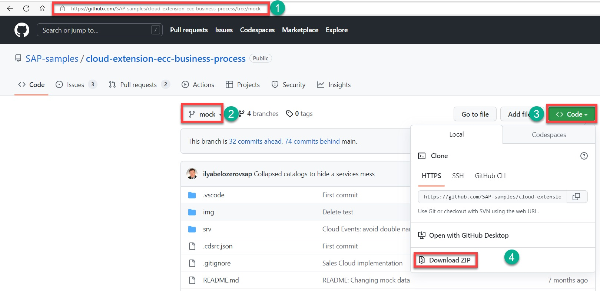

# Make Sure Prerequisites are Fulfilled and all Required Systems are in Place

To execute all the necessary steps of the tutorial, you will need the following systems, services, and tools available:

## 1. Systems and Accounts

1. [Optional] [SAP S/4HANA Cloud](https://www.sap.com/products/erp/s4hana-erp.html) system. You will run this scenario by installing a [mock-server](https://github.com/SAP-samples/cloud-extension-ecc-business-process/tree/mock) as a backend instead of [SAP S/4HANA Cloud](https://www.sap.com/products/erp/s4hana-erp.html), for that  you would need 256MB of Cloud Foundry runtime.
2. [Global account](https://help.sap.com/products/BTP/65de2977205c403bbc107264b8eccf4b/8ed4a705efa0431b910056c0acdbf377.html?locale=en-US#loioc165d95ee700407eb181770901caec94) in SAP BTP
3. [Configure your global account in SAP BTP using the Setup Automator tool (Optional)](https://github.com/SAP-samples/btp-setup-automator)
4. [SAP Analytics Cloud](https://help.sap.com/docs/SAP_ANALYTICS_CLOUD)

## 2. Prerequisites for SAP BTP
1. Enable SAP BTP Cloud Foundry [global account](https://developers.sap.com/tutorials/cp-cf-entitlements-add.html).
2. SAP BTP [subaccount](https://help.sap.com/products/BTP/65de2977205c403bbc107264b8eccf4b/8ed4a705efa0431b910056c0acdbf377.html?locale=en-US#loio8d6e3a0fa4ab43e4a421d3ed08128afa)
3. SAP BTP space
4. The application requires the following [Entitlements and Quotas](https://help.sap.com/products/BTP/65de2977205c403bbc107264b8eccf4b/00aa2c23479d42568b18882b1ca90d79.html?locale=en-US) in the SAP BTP cockpit. :

| Service                                        | Plan             |
|------------------------------------------------|------------------|
| Cloud Foundry Runtime                          | standard         |   
| SAP Build Work zone standard edition           | standard edition |
| SAP Business Application Studio                | standard edition |
| SAP HANA Cloud                                 | hana             |
| SAP Build Work zone standard edition           | standard edition |
| Destination service                            | lite             |

* You can find out which BTP services [Free Tier and Always Free plans](https://help.sap.com/docs/btp/sap-business-technology-platform/trial-accounts-and-free-tier) and what the limitations are in the [SAP Discovery Center service catalog overview](https://discovery-center.cloud.sap/viewServices)
  
### 4. The SAP Risk Management Reference Application

1. [Optional] - Complete the tutorial on [How to develop and deploy an application based on SAP Cloud Application Programming Model CAP](https://github.com/SAP-samples/cloud-cap-risk-management/tree/ext-service-s4hc-use). We will customize rik management application to add analytics articacts later in our scenario. 

2. Download risk management application zip file developped with CAP (SAP Cloud Application Programming model) from repository: [ext-service-s4hc-use](https://github.com/SAP-samples/cloud-cap-risk-management/tree/ext-service-s4hc-use)

### 5. Mock Server :
1. This step is only needed when you decide to use [mock-server](https://github.com/SAP-samples/cloud-extension-ecc-business-process/tree/mock) as a backend instead of [SAP S/4HANA Cloud](https://www.sap.com/products/erp/s4hana-erp.html).
2. For OData API’s (e.g. from S/4HANA, ECC etc.),  [mock-server](https://github.com/SAP-samples/cloud-extension-ecc-business-process/tree/mock) will be used to speed up scenario implementation without ERP/Cloud Connector configuration, and limit the scope of troubleshooting for BTP cloud services only.
3. Download mock-server application zip file from repository: [mock-server](https://github.com/SAP-samples/cloud-extension-ecc-business-process/tree/mock)

