# Create Business Users and Business Roles in the SAP S/4HANA Cloud System

In SAP S/4HANA Cloud, applications and systems can be accessed by business users or technical users. Authorizations for business users are based on business roles. Authorizations for technical users are based on communication scenarios.

See the [Set Up Your SAP S/4HANA Cloud](https://help.sap.com/docs/SAP_S4HANA_CLOUD/b249d650b15e4b3d9fc2077ee921abd0/a231ac4439e24935b0447bc49e75995c.html) section in SAP Help Portal.

To run the sample application included in this mission, see the [Authorization and User Concept in SAP S/4HANA Cloud](https://help.sap.com/docs/SAP_S4HANA_CLOUD/b249d650b15e4b3d9fc2077ee921abd0/bbae7c15953443fea0b5b0211488e919.html) section in SAP Help Portal.

## [Optional] Set Up SAP S/4HANA Cloud

SAP S/4HANA Cloud system provides a large number of features to support your company's business processes.
If you have already have an administrator user for the SAP S/4HANA Cloud system, you can skip this step. See the [User Onboarding for SAP S/4HANA Cloud](https://help.sap.com/docs/SAP_S4HANA_CLOUD/b249d650b15e4b3d9fc2077ee921abd0/30415f166409468689b31571989e4b95.html) section in SAP Help Portal if you have created initial users for your SAP S/4HANA Cloud system. Follow the official documentation, to do the initial setup for your Starter, Quality, and Productive systems.

### [Optional] Create the Administrator Business User and Role

If you already have an administrator user with an administrator role for the SAP S/4HANA Cloud system, you can skip this step. Otherwise, follow the official documentation. See [Create an Administrator Business User](https://help.sap.com/docs/SAP_S4HANA_CLOUD/b249d650b15e4b3d9fc2077ee921abd0/f5064daae98044809f29046df1b8c0da.html) and [Create the business role for an Administrator](https://help.sap.com/docs/SAP_S4HANA_CLOUD/55a7cb346519450cb9e6d21c1ecd6ec1/8fa28e0107984d42a99b9eea67856cea.html). Also make sure that the Administrator user is imported in the Identity Authentication service. See the [Self-Activation of Business Users in the Identity Authentication Service](https://help.sap.com/docs/SAP_S4HANA_CLOUD/b249d650b15e4b3d9fc2077ee921abd0/7471582739dc4bb38a291859d82f7d47.html) section.

### [Optional] Create the Employee Business Role

Now you have to create a business role for the employees. You can skip this step if you already have an employee business role in your SAP S/4HANA Cloud system.

1. Access your SAP S/4HANA Cloud system with your new administrator business user. Use the URL, which you have received from the Identity Authentication service in the format **https://\<mys4hc\>.s4hana.ondemand.com**.

2. Access the **Maintain Business Roles** application and create the employee business role by choosing **Create from Template**.

   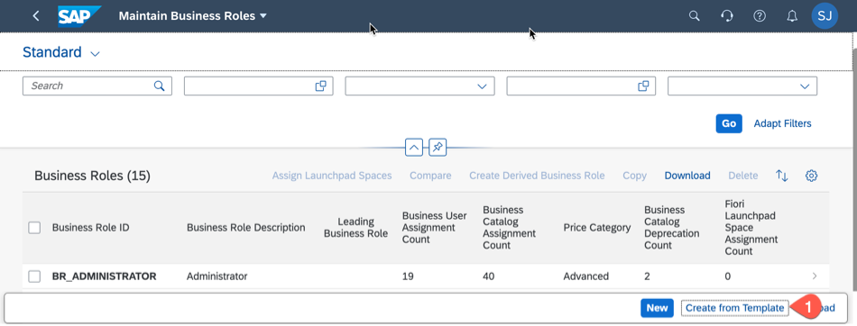

3. Choose the **SAP\_BR\_EMPLOYEE** template, enter **New Business Role ID**, and choose **OK**.

   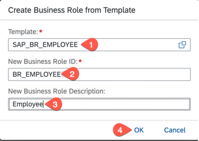

### Create the Business Role to Access Business Partner Application

You can skip this step, if your SAP S/4HANA Cloud system already has a business role to access the **Maintain Business Partner** application.

1. In your SAP S/4HANA Cloud system, access the **Maintain Business Roles** application and choose **Create from Template**.

2. Choose the **SAP\_BR\_BUPA_MASTER\_SPECIALIST** template, enter a **New Business Role ID**, and choose **OK** to create the role, which has to be assigned to your business users to access the Business Partners application.

### [Optional] Create Employees and Business Users

Import and create basic business users to run the sample application. If you already have a business user, you can skip this step. See the [Import Employees](https://help.sap.com/docs/SAP_S4HANA_CLOUD/0bebd08dffca45afa67b1f751199afd0/1b32df57f8c2073ee10000000a4450e5.html) section.

1. In your SAP S/4HANA Cloud system, choose the **Import Employees** tile.

   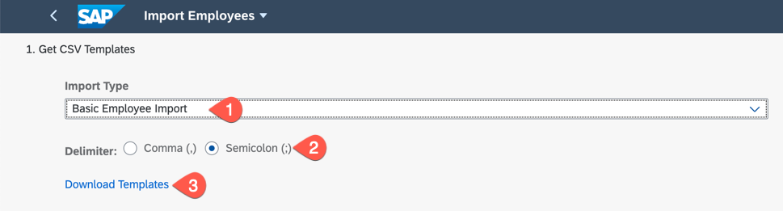

2. You will get a message that the download is complete. Choose **OK** to close the popup.

   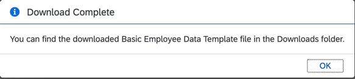

3. Open the downloaded CSV template and check the sample values provided.

4. Fill the mandatory columns for all the employees to be imported. Fill the **EmailAddress** field for all the employees as we need the e-mail address for activation of user in the Identity Authentication service.

5. Delete the default sample employee data and save the changes.

6. In the **Import Employees** application:
   - Check **Import Type** and select **Basic Employee Import**.
   - Select the same **Delimiter** format as the CSV file, which you have downloaded earlier.
   - In **Import Data**, choose **Browse** and select the file and choose **Open**.
   - Enter a meaningful **Import Name** and choose **Import**.

   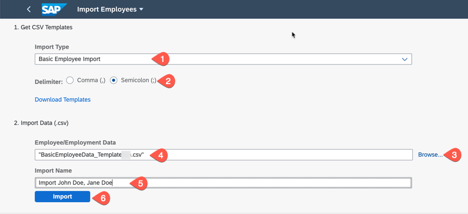

7. Choose **OK** in the popup, which opens up the **Monitor Employee Imports** application.

   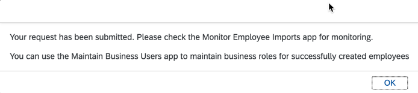

**Note:** Alternatively, you can enter **Monitor Employee Imports** in the search field to open the application, to check if the import of the employees was successful.

   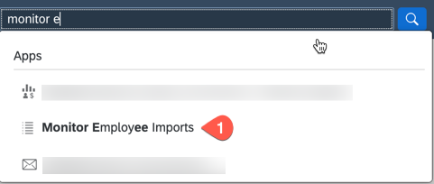

## Maintain Business User and Business Roles in the SAP S/4HANA Cloud System

1. In your SAP S/4HANA Cloud system, choose the **Maintain Business Users** tile.

2. Select the imported business user from the previous step.

   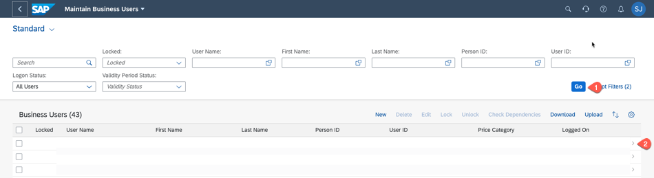

3. In the section **Assigned Business Roles**, choose **Add**.

   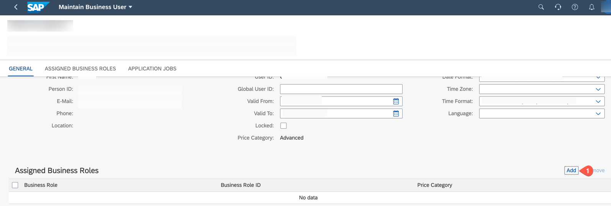

4. Choose the roles **BR\_EMPLOYEE** and **BR\_BUPA\_MASTER\_SPECIALIST** and choose **OK** to give employee role and role to access the **Maintain Business Partner** application and data.

   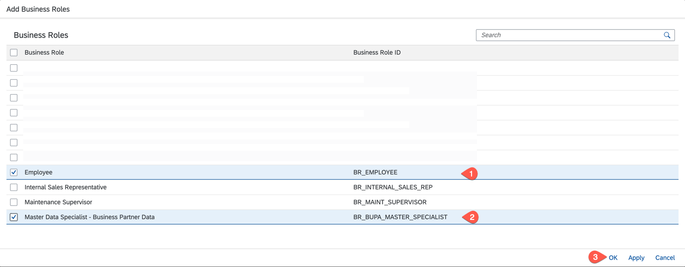

5. Choose **Save** to save the changes and repeat the previous steps for all imported employees. You can also create additional business roles from a template and assign the respective business roles.

   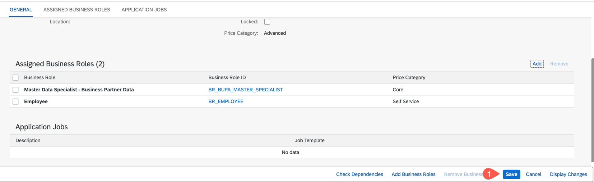

## Import Business Users in Identity Authentication

Now you have to import the newly created business users in the Identity Authentication service, which comes along with your SAP S/4HANA Cloud tenant and also sends activation mails for the business users. You can skip this step if your business user is already in the Identity Authentication tenant.

1. In your SAP S/4HANA Cloud system, in the **Maintain Business Users** application, choose **Download** and **Download for IDP** to download the added business users.

   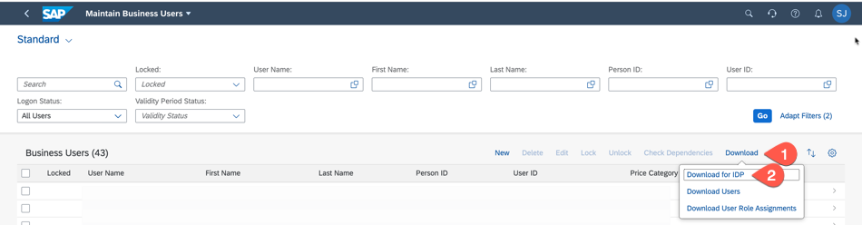

2. Log on to the Identity Authentication tenant with your administrator user.

3. Access the **Import Users** application and choose the CSV file, which you have downloaded in step 1 and choose **Import** to import the users.

   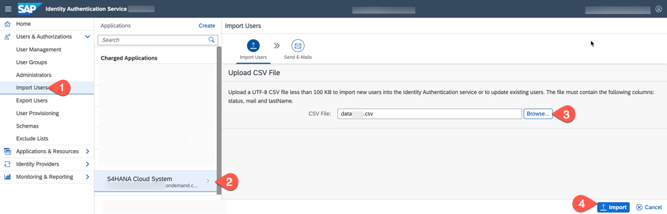

   

4. Select **Send E-Mails** and choose **Send** to send activation e-mails to the newly imported users. The business users can now access the SAP S/4HANA Cloud system.

## Summary

You have successfully finished the initial setup of your SAP S/4HANA Cloud system, created an administrator user, business user, and assigned relevant roles for all the business users.
