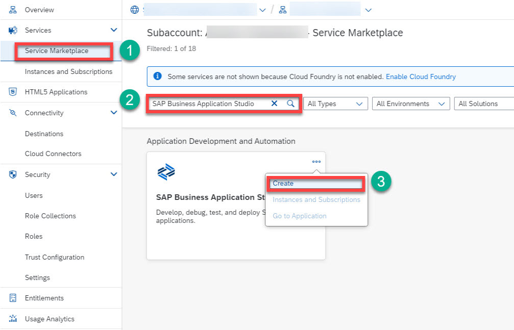
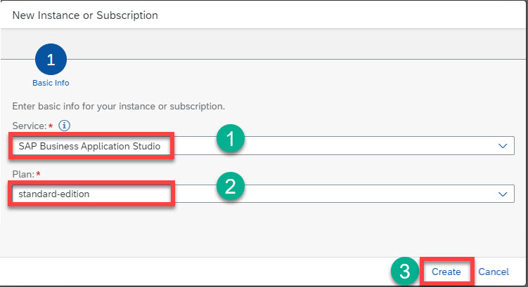
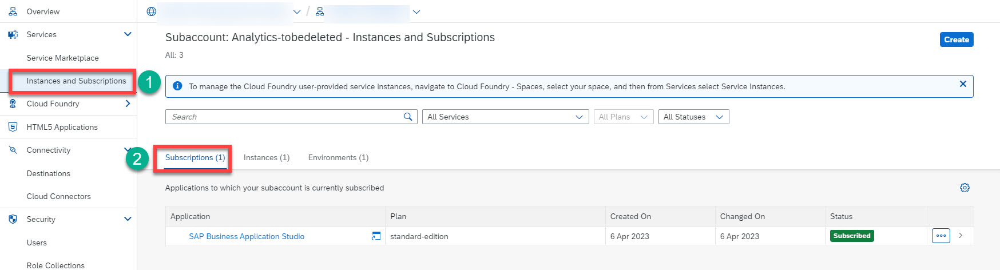
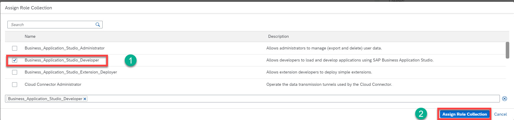

# Set Up SAP Business Application Studio

To accelerate development process, we will use [SAP Business Application Studio](https://learning.sap.com/learning-journey/develop-full-stack-applications-using-productivity-tools-in-sap-business-application-studio) as a cloud-based development environment, where professional developers can quickly create and customize applications by leveraging reusable components, preconfigured templates, and wizards, reducing development time and effort.

  ### 1. Subscribe to SAP Business Application Studio
  1. Open SAP BTP cockpit and go to your global account.
  2. Choose **Account Explorer** and then **Services** &rarr; **Service Marketplace**.
  3. Search for the **SAP Business Application Studio** tile and choose **Create**. If this tile doesn’t exist in the list, go to **Entitlements** and choose **Add Service Plans**.

  

   4. The default settings are **SAP Business Application Studio** in the **Service** field, and **standard-edition** in the **Plan** field. Keep these settings and choose **Create**.
  
  
  
  5. You have now subscribed to the SAP Business Application Studio.
  
  

  ## 2. Assign SAP Business Application Studio Role Collection
  
  **_NOTE:_** You need to assign your user to the Business_Application_Studio_Developer role collection, so you don’t get an error accessing the SAP Business Application Studio application from the cockpit later on.
  
 1. Choose **Security** &rarr; **Users** and then choose your user.
 2. in the **Role Collections** section, choose **Assign Role Collection** and assign the **Business_Application_Studio_Developer** role collection to your user.
 
 
