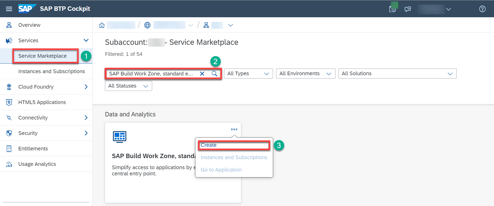
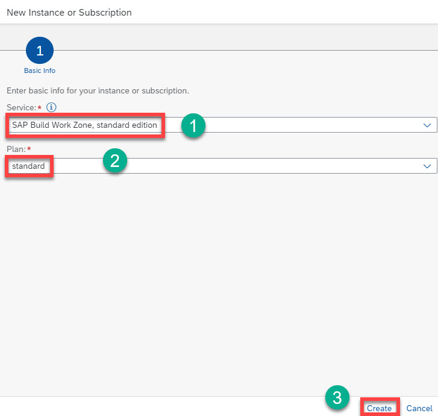
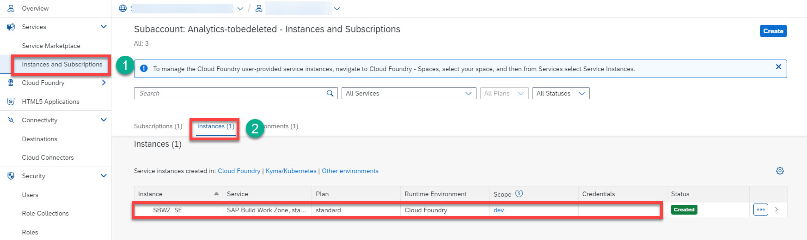
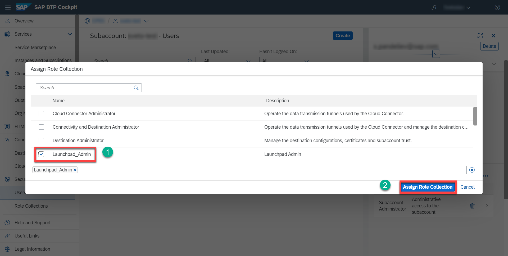

# Set Up SAP Build Work Zone, standard edition

[SAP Build Work Zone](
https://learning.sap.com/learning-journey/implement-and-administer-sap-build-work-zone), Standard Edition is a digital workplace solution that offers centralized access to business applications, content, and processes. It enables personalization, collaboration, and seamless integration with both SAP and non-SAP applications.
## 1. Subscribe to SAP Build Work Zone, standard edition

  1. Open SAP BTP cockpit and go to your global account.
  2. Choose **Account Explorer** and then **Services** &rarr; **Service Marketplace**.
  3. Search for the **SAP Build Work Zone, standard edition** tile and choose **Create**. If this tile doesn’t exist in the list, go to **Entitlements** and choose **Add Service Plans**.

  

  4. The default settings are **SAP Build Work Zone, standard edition** in the **Service** field, and **standard subscription** in the **Plan** field. Keep these settings and choose **Create**.
  
  
  
  5. You have now subscribed to the SAP Build Work Zone, standard edition.
  
  

  ## 2. Assign SAP Build Work Zone, standard edition Role Collection

  You need to assign your user to the **Launchpad_Admin** role collection, so you don’t get an error accessing the SAP Build Work Zone, standard edition site later on.

  1. Choose **Security** &rarr; **Users** and then choose your user.
  2. In the **Role Collections** section, choose **Assign Role Collection** and assign the **Launchpad_Admin** role collection to your user.

  
